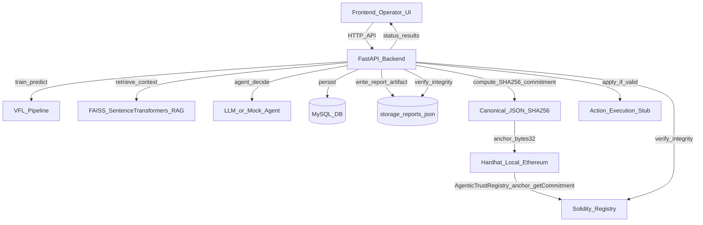

# PRAGMA

[](https://www.python.org/downloads/)
[](https://pytorch.org/)
[](frontend/LICENSE.md)
[](https://ieee-dataport.org/documents/unified-multimodal-network-intrusion-detection-systems-dataset)
[](https://jupyter.org/)
[](https://github.com/slundberg/shap)
[](https://www.langchain.com/)
[](https://ethereum.org/)
[](https://soliditylang.org/)

PRAGMA is an implementation of an **agentic AI pipeline for enterprise network intrusion detection**, combining **Vertical Federated Learning (VFL)** for privacy-preserving cross-domain detection, **SHAP-based explainability** to attribute alerts, and **RAG-grounded reasoning** to generate mitigation recommendations from retrieved policy context.

To address accountability, PRAGMA includes a **blockchain trust layer** implemented as **hash-only anchoring**: after an agentic report is produced and persisted, the backend computes a deterministic SHA-256 commitment over a canonical JSON payload and anchors only the resulting `bytes32` digest on an Ethereum smart contract. Before applying any report-derived actions, the backend verifies the on-chain commitment against the database record and the saved report artifact; execution is blocked if integrity verification fails.

## Overview

PRAGMA is organized into three components that together support an operator-facing workflow from detection to decision to integrity-verified execution:

This repository contains three main components:

- **Frontend** (`frontend/`): operator UI (React + Vite + Material UI template)
- **Backend** (`backend/`): FastAPI service for VFL utilities, batch predictions, RAG (FAISS + SentenceTransformers), agentic report generation, persistence, and trust anchoring/verification
- **Blockchain** (`hardhat-blockchain/`): Hardhat local Ethereum + Solidity registry contract (`AgenticTrustRegistry`) used as an immutable commitment log

## What the blockchain layer does (in this repo)

The Solidity contract is a **minimal commitment registry**:

- The backend computes a deterministic **SHA-256** commitment over a **canonical JSON payload** of an agentic report (IDs, timestamps, raw LLM output, retrieved context, optional structured plan).
- Only the resulting `bytes32` digest is anchored on-chain via `anchor(agentKey, reportKey, commitment)`.
- Before applying any report-derived actions, the backend verifies:
  - **On-chain commitment** == DB anchor record
  - **Recomputed commitment from saved report artifact** == DB anchor record
- Execution is blocked if integrity verification fails.

This is **hash-only anchoring** (no sensitive data on-chain): the chain provides immutability; the backend provides verification + execution gating.

## System diagram



## Technologies used

- **Backend**
  - Python 3.8+ (recommended: 3.11+; see `backend/README.md`)
  - FastAPI + Uvicorn
  - SQLAlchemy + MySQL (PyMySQL)
  - PyTorch (`torch`) + SHAP (`shap`) for model explainability workflows
  - RAG: FAISS (`faiss-cpu`) + SentenceTransformers
  - LangChain (`langchain-core`, `langchain-community`, `langchain-text-splitters`) for RAG/agent utilities
  - Agentic actions: optional OpenAI-backed flow (falls back to mock behavior if `OPENAI_API_KEY` is unset)
  - Blockchain client: `web3.py` (JSON-RPC)
- **Blockchain**
  - Hardhat local chain (JSON-RPC `http://127.0.0.1:8545`, chain id `31337`)
  - Solidity `^0.8.x`
  - ethers.js scripts for deploy + interaction
- **Frontend**
  - React + Vite
  - Material UI-based admin template

## Dataset and notebooks

- **Dataset (CSV)**: `sample.csv` (and any CSVs you upload/use through the backend workflows).
- **Jupyter**: notebooks are under `backend/notebooks/` (install separately: `pip install notebook ipykernel`).

## License

This repo includes a frontend template license at `frontend/LICENSE.md`. If you want a single repo-wide license file, add one at the repo root (e.g., `LICENSE`).

## Quick start (local dev)

### 1) Start the local blockchain

See the full instructions in [`hardhat-blockchain/README.md`](hardhat-blockchain/README.md).

Typical flow:

```bash
cd hardhat-blockchain
npm install
npm run node
```

In a second terminal:

```bash
cd hardhat-blockchain
npm run deploy:local
```

Copy the deployed contract address and one funded private key printed by Hardhat.

### 2) Start the backend (FastAPI)

See [`backend/README.md`](backend/README.md) for full setup (MySQL + venv).

Minimal steps:

```bash
cd backend
python -m venv .venv
.venv\Scripts\activate   # Windows
pip install -r requirements.txt
```

Create `backend/.env` from `.env.example` and set at least:

- `TRUST_CHAIN_ENABLED=true`
- `TRUST_CHAIN_RPC_URL=http://127.0.0.1:8545`
- `TRUST_CHAIN_CHAIN_ID=31337`
- `TRUST_CHAIN_CONTRACT_ADDRESS=<deployed_contract_address>`
- `TRUST_CHAIN_PRIVATE_KEY=<hardhat_dev_private_key>`

Run:

```bash
uvicorn app.main:app --reload --host 0.0.0.0 --port 8000
```

Backend docs: `http://127.0.0.1:8000/docs`

### 3) Start the frontend (operator UI)

```bash
cd frontend
npm install
npm run dev
```

By default, Vite runs at `http://localhost:3039`.

If your UI supports it, set `VITE_API_BASE_URL` to the backend origin (e.g., `http://127.0.0.1:8000`).

## Useful pointers in the codebase

- **Smart contract**: `hardhat-blockchain/contracts/AgenticTrustRegistry.sol`
- **Deploy script**: `hardhat-blockchain/scripts/deploy.js`
- **Anchor demo script**: `hardhat-blockchain/scripts/interact.js`
- **Commitment format + chain calls**: `backend/app/services/trust_chain_service.py`
- **Anchor persistence + verification gate**: `backend/app/services/agent_service.py`
- **Technical report**: `docs/Blockchain_Trust_Layer_for_Agentic_Actions_Technical_Report.md`

## Notes

- The trust layer is designed to keep sensitive content off-chain (only `bytes32` commitments are stored).
- The local Hardhat chain is for demos/experiments; never use dev keys on real networks.
