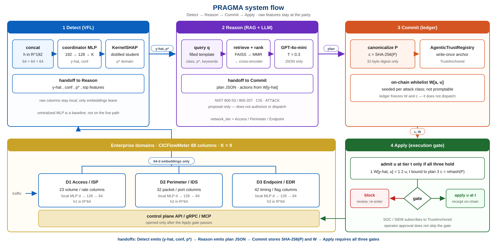
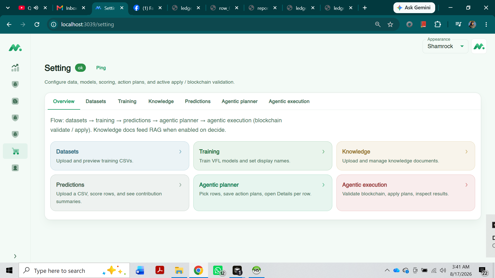

# PRAGMA

[](https://www.python.org/downloads/)
[](https://pytorch.org/)
[](frontend/LICENSE.md)
[](https://ieee-dataport.org/documents/unified-multimodal-network-intrusion-detection-systems-dataset)
[](https://jupyter.org/)
[](https://github.com/slundberg/shap)
[](https://www.langchain.com/)
[](https://ethereum.org/)
[](https://soliditylang.org/)

PRAGMA is an **agentic AI pipeline for enterprise network intrusion detection**: **Vertical Federated Learning (VFL)** for privacy-preserving cross-domain detection, **SHAP** to attribute alerts, **hybrid RAG** to ground mitigation plans in a closed policy corpus, and a **blockchain apply gate** so only whitelist-legal, plan-bound actions execute.

This codebase (**ChainAgentVFL**, branch `pragma_v3`) implements that stack for paper experiments and demos. A related reference tree is at [`github.com/sharif2008/pragma`](https://github.com/sharif2008/pragma). Drive workflows from the **React UI** or **terminal** (`backend/scripts/`).

### Demo

[](https://youtu.be/YgUtq4202oU)

**Watch on YouTube:** [https://youtu.be/YgUtq4202oU](https://youtu.be/YgUtq4202oU)

## Overview

Three repo components:

- **Frontend** (`frontend/`): operator UI (React + Vite + Material UI)
- **Backend** (`backend/`): FastAPI — VFL utilities, batch predictions, hybrid RAG (FAISS + BM25 + RRF + MMR), agentic Mitigation Plans, persistence, and on-chain store / apply
- **Blockchain** (`hardhat-blockchain/`): Hardhat local Ethereum + `AgenticTrustRegistry` (per-attack whitelist, `storePlan` / `revisePlan` / `markApplied`)

## System design



Detect → Reason → Commit → Apply across Access / Perimeter / Endpoint.

| Layer | What it does | What it hands off |
|-------|----------------|-------------------|
| **Detect** | Three local MLPs emit 64-d embeddings; the coordinator concatenates to 192-d and classifies; KernelSHAP names the dominant domain `p*`. | `(ŷ, conf, p*)` |
| **Reason** | Template query → dense FAISS N=80 + BM25 N=80 (same child ids) → RRF → MMR λ=0.5 → 20 children → 5 parents → LLM (`gpt-6-luna`) with SHAP. Actions must already be in `W[ŷ]`. | Mitigation Plan JSON |
| **Commit** | Planner calls `storePlan`: attack type, `{action, tier}` units, `reasoningHash = SHA-256(overall_reasoning)`. Reasoning text stays off-chain. Whitelist `W` is seeded on-chain at deploy. | `planId`, `c` |
| **Apply** | Tier executor `markApplied(u, τ)` only if the action is in `W[attack]`, bound to the stored plan, the digest matches, and the caller is that tier’s key. Else block; human `revisePlan` re-enters the same gate. | apply or block |

## What the blockchain layer does

`AgenticTrustRegistry` is a **governance record**, not a hash-only digest log:

- **Whitelist** `W[attackType][action]` and roles (planner, reviewer, one executor per tier) are stored at deploy from `attack_options.json`.
- **`storePlan`** writes job / prediction ids, attack type, threat level, primary and supporting `{action, tier}` units, and `reasoningHash`. The rationale itself is never on-chain.
- **`markApplied`** records each executed unit. It reverts on unknown attack type, off-whitelist action, plan mismatch, hash mismatch, wrong-tier caller, superseded plan, or duplicate apply.
- An agent may **re-plan once**; further correction is a reviewer `revisePlan`. Revising supersedes the parent so it can no longer be applied.

Sensitive payload stays off-chain; the chain is the immutable policy + audit gate.

## Experiments (`pragma_v3`)

Specs live in `.agent/`. Shared **input CSVs** live in `experiments/data/` (other tasks may read, must not write). Live **results** stay under each task folder (`experiments/**` is gitignored except `data/` and gold JSON).

| Case | Input | Results | Script / spec |
|------|-------|---------|----------------|
| Gold freeze (90 = 10×9) | `experiments/data/gold-100/` | `experiments/gold-100/ground_truth-100.json` | `pragma-gold-100` |
| RAG vs LLM-only (default x=200) | `experiments/data/eval-200/` | `experiments/rag/eval-200/` (or `hybrid_eval200/`) | `rag_eval100.py` / `pragma-rag-eval-x` |
| Detect → RAG → reason → chain (1000) | `experiments/data/e2e-detect-chain/` | `experiments/e2e-detect-chain/` | `reason_1000.py` / `pragma-e2e-detect-chain` |
| Agentic attack + authorization (A1–A25) | gold-eval plans (read-only) | `experiments/agentic-attack/` | `agentic_attack_eval.py` / `pragma-agentic-attack` |

`eval-10` ⊂ `eval-100` ⊂ `eval-200` ⊂ `rag_reason_500`. All disjoint from gold-100. Do not use gold-100 **rows** as the eval-x set; gold is the **class chunk-concat** BERTScore / ROUGE baseline only.

**RAG eval-x (A vs B, n=200).** Two systems only — no `RAG_No_Ranking`. A = LLM, no RAG, no SHAP. B = hybrid retrieve + 5 parents + SHAP. Headline (class gold concat):

| Metric | No RAG (A) | RAG + SHAP (B) | B − A |
|--------|-----------:|---------------:|------:|
| BERTScore F1 | 0.774 | 0.817 | +0.043 |
| ROUGE-1 | 0.138 | 0.333 | +0.195 |
| ROUGE-L | 0.068 | 0.139 | +0.071 |

Primary action ∈ `W[true]`: No RAG 200/200 · RAG + SHAP 194/200. Per-class `k/n (%)` tables: `experiments/rag/hybrid_eval200/report.md`.

**Agentic attack.** Injected threats A1–A25 against stored honest plans: **Block.% = 100** on every injected row; **0** tamper accepts; authorization A13–A20 **8/8**. Honest store 170/270 (100 skips are `attack_type_unresolved`, not chain failures). Report: `experiments/agentic-attack/report.md`.

Console paper stages: [`experiments/README.md`](experiments/README.md). Paper draft: [`docs/Pragma_v2.tex`](docs/Pragma_v2.tex).

## Technologies used

- **Backend**
  - Python 3.8+ (recommended: 3.11+; see `backend/README.md`)
  - FastAPI + Uvicorn
  - SQLAlchemy + MySQL (PyMySQL)
  - PyTorch (`torch`) + SHAP (`shap`)
  - RAG: FAISS (`faiss-cpu`) + BM25 over the same child store + SentenceTransformers
  - LangChain (`langchain-core`, `langchain-community`, `langchain-text-splitters`)
  - LLM: `OPENAI_MODEL` (paper runs: **`gpt-6-luna`**, T=0)
  - Blockchain client: `web3.py` (JSON-RPC)
- **Blockchain**
  - Hardhat local chain (JSON-RPC `http://127.0.0.1:8545`, chain id `31337`)
  - Solidity `^0.8.x` (`AgenticTrustRegistry`)
  - ethers.js scripts for deploy + interaction
- **Frontend**
  - React + Vite
  - Material UI-based admin template

## Operator UI (Setting)



## Dataset and notebooks

- **Eval traffic**: CIC-IDS2017-style undersampled CSV (local `datasets/`; not in git). Paper splits: gold-100 and eval-x under `experiments/data/`.
- **UI / batch CSV**: `backend/run/data/sample.csv` (and uploads through backend workflows).
- **Jupyter**: `backend/notebooks/` (`pip install notebook ipykernel`).

## License

This repo includes a frontend template license at `frontend/LICENSE.md`. If you want a single repo-wide license file, add one at the repo root (e.g., `LICENSE`).

## Quick start (local dev)

### 1) Start the local blockchain

See [`hardhat-blockchain/README.md`](hardhat-blockchain/README.md).

```bash
cd hardhat-blockchain
npm install
npm run node
```

In a second terminal:

```bash
cd hardhat-blockchain
npm run deploy:local
```

Copy the deployed contract address and one funded private key printed by Hardhat.

### 2) Start the backend (FastAPI)

See [`backend/README.md`](backend/README.md) for full setup (MySQL + venv).

```bash
cd backend
python -m venv .venv
.venv\Scripts\activate   # Windows
pip install -r requirements.txt
```

Create `backend/.env` from `.env.example` and set at least:

- `TRUST_CHAIN_ENABLED=true`
- `TRUST_CHAIN_RPC_URL=http://127.0.0.1:8545`
- `TRUST_CHAIN_CHAIN_ID=31337`
- `TRUST_CHAIN_CONTRACT_ADDRESS=<deployed_contract_address>`
- `TRUST_CHAIN_PRIVATE_KEY=<hardhat_dev_private_key>`
- `OPENAI_API_KEY` / `OPENAI_MODEL=gpt-6-luna` (for live Mitigation Plans)

Run:

```bash
uvicorn app.main:app --reload --host 0.0.0.0 --port 8000
```

Backend docs: `http://127.0.0.1:8000/docs`

### 3) Start the frontend (operator UI)

```bash
cd frontend
npm install
npm run dev
```

By default, Vite runs at `http://localhost:3039`.

If your UI supports it, set `VITE_API_BASE_URL` to the backend origin (e.g., `http://127.0.0.1:8000`).

### Paper evals (optional)

From `backend/` with the venv:

```bash
python scripts/rag_eval100.py --offgold-n 200 --systems LLM_only,RAG_RANKING
python scripts/rag_eval100.py --offgold-n 200 --offgold-report-only --systems LLM_only,RAG_RANKING
python scripts/agentic_attack_eval.py
```

## Useful pointers

- **Smart contract**: `hardhat-blockchain/contracts/AgenticTrustRegistry.sol`
- **Deploy**: `hardhat-blockchain/scripts/deploy.js`
- **Plan store / apply**: `backend/app/services/trust_chain_service.py`
- **Hybrid retrieve**: `backend/scripts/rag_hybrid.py`
- **RAG eval-x**: `backend/scripts/rag_eval100.py`
- **Agentic attack A1–A25**: `backend/scripts/agentic_attack_eval.py`
- **Gold freeze**: `backend/scripts/gold_freeze.py`
- **E2E 1000**: `backend/scripts/reason_1000.py`
- **Shared inputs**: `experiments/data/`
- **Gold JSON**: `experiments/gold-100/ground_truth-100.json`

## Notes

- Reasoning text never goes on-chain; only `reasoningHash` and `{action, tier}` units do.
- The local Hardhat chain is for demos/experiments; never use dev keys on real networks.
- Gold-100 is reserved (10 per class). Eval-x and e2e-1000 must not reuse those `split_index` values.
